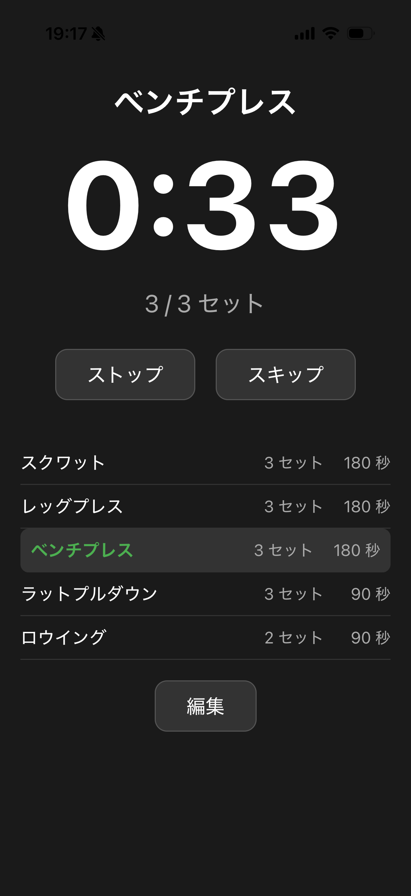
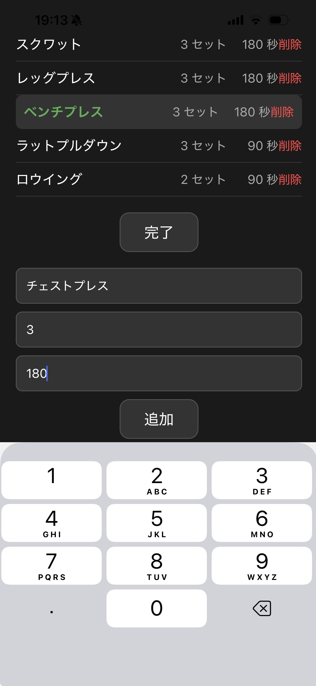

# GymTimer

筋トレのインターバルを自動で管理するスマートフォンアプリです。

 &nbsp;&nbsp;&nbsp;&nbsp; 

## 開発背景

筋トレ中にiPhoneの時計アプリでタイマーを使っていましたが、種目ごとにインターバルを毎回設定し直す手間が小さなストレスになっていました。また、タイマー終了時に音楽が止まってしまうのも不便でした。
App Storeで理想のアプリを探しましたが見つからなかったため、自分で開発することにしました。

## 主な機能

- 種目・セット数・インターバルの登録と保存
- 種目終了後に次の種目へ自動遷移し、タイマーをリセット
- バックグラウンド通知（他のアプリを使用中でもインターバル終了を通知）
- 効果音（フォアグラウンド時）
- データ永続化（アプリを閉じても種目が保持される）

## 使用技術

- React Native / Expo
- TypeScript
- AsyncStorage（データ保存）
- expo-audio（効果音）
- expo-notifications（プッシュ通知）

## 開発期間

2026年3月

## 開発環境

- Windows / VSCode
- Expo Go（iPhoneで動作確認）
